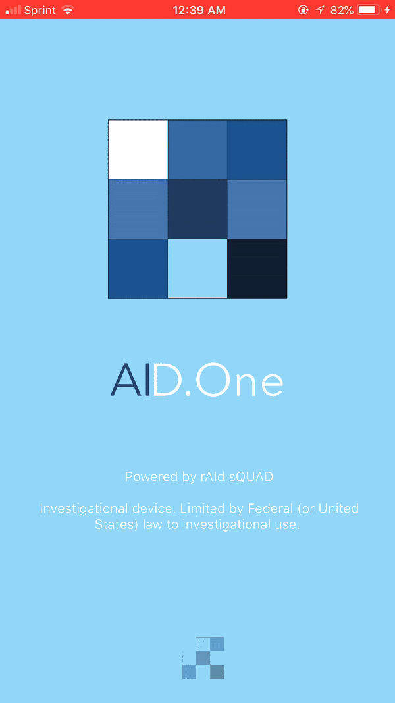

# Project Title

A proof-of-concept mobile implementation of a validated artificial intelligence-based personalized dosing platform intended for clinician use. Technology developed by Dean Ho and Chih-ming Ho Labs

## AID.One

## Deployment

Contact for deployment on local device

## Built With

* [Swift]

## Authors

* **Jeffrey Khong** - *App interface, user-input, regression optimization*

* **Michael Trieu** - *Backend regression, graphical interfaces*
